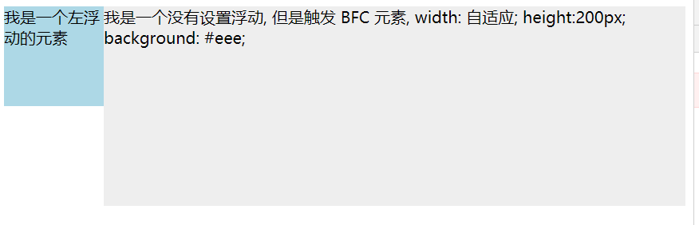

# 1. 盒模型


# 一、盒模型

CSS 盒模型包括几个属性：

- 外边距 margin
- 边框 border
- 内边距 padding
- 实际内容 content


## W3C 标准盒模型


## IE 怪异盒模型


## 两种盒模型的区别

计算的宽度和高度不同

标准盒模型：盒子总宽高 = `width/height + padding + border + margin`（即 width/height 只是 content 的宽高，不包含 padding 和 border

IE盒子模型：盒子总宽高 = `width/height + margin = content 宽高 + padding + border + margin` （即 width/height 包含了 padding 和 border 


 ## 盒模型的设置

标准：`box-sizing: content-box` （浏览器默认设置

IE：`box-sizing: border-box`


## 获取盒子的宽高

1. `dom.style.width/height` ：只能取到行内样式的宽高（在 js 代码中定义的宽高），style 标签中和 link 外链的样式取不到
2. `dom.currentStyle.width.height`：（只有 IE 兼容）取到的是最终渲染后的宽高
3. `dom.offsetWidth/offsetHeight`：包括宽高、内边距和边框，不包括外边距。**最常用且兼容性最好**（会进行四舍五入）
4. `dom.getBoundingClientRect().width/height`：获取渲染后的宽高，大多数浏览器支持，IE9 以上支持（数据较为精确）
5. `window.getComputedStyle(dom).width/height`：获取最终渲染后的宽高，大多数浏览器支持，IE9 以上支持（返回结果是字符串，会带 `px`）


# 二、BFC

https://zhuanlan.zhihu.com/p/25321647

## 2.1 常见定位方案

有三种常见的定位方案：

- 普通流（normal flow）

  > 在普通流中，元素按照其在 HTML 中的先后位置至上而下布局，在这个过程中，行内元素水平排列，直到当行被占满然后换行，块级元素则会被渲染为完整的一个新行，除非另外指定，否则所有元素默认都是普通流定位，也可以说，普通流中元素的位置由该元素在 HTML 文档中的位置决定。

- 浮动（float）

  > 在浮动布局中，元素首先按照普通流的位置出现，然后根据浮动的方向尽可能的向左边或右边偏移，其效果与印刷排版中的文本环绕相似。

- 绝对定位（absolute positioning）

  > 在绝对定位布局中，元素会整体脱离普通流，因此绝对定位元素不会对其兄弟元素造成影响，而元素具体的位置由绝对定位的坐标决定。


## 2.2 BFC 概念

Formatting context(格式化上下文) 是 W3C CSS2.1 规范中的一个概念。它是页面中的一块渲染区域，并且有一套渲染规则，它决定了其子元素将如何定位，以及和其他元素的关系和相互作用。


BFC 即 Block Formatting Contexts (块级格式化上下文)，它属于上述定位方案的普通流。

**具有 BFC 特性的元素可以看作是隔离了的独立容器，容器里面的元素不会在布局上影响到外面的元素，并且 BFC 具有普通容器所没有的一些特性。**


## 2.3 触发 BFC

只要元素满足下面任一条件即可触发 BFC 特性：

- body 根元素
- 浮动元素：float 除 none 以外的值
- 绝对定位元素：position (absolute、fixed)
- display 为 inline-block、table-cells、flex
- overflow 除了 visible 以外的值 (hidden、auto、scroll)


## 2.4 BFC 的特性

### 2.4.1 同一个 BFC 下外边距会发生折叠


**如果想要避免外边距的重叠，可以将其放在不同的 BFC 容器中。**


### 2.4.2 BFC 可以包含浮动的元素（清除浮动）

即容器设置 `overflow: hidden`


### 2.4.3 BFC 可以阻止元素被浮动的元素遮盖

即相邻元素设置 `overflow：hidden` 清除浮动


因此这个方法可以用来**实现两列自适应布局**，效果不错，这时候**左边的宽度固定**，**右边的内容自适应宽度**。

```html
<div style="height: 100px;width: 100px;float: left;background: lightblue">我是一个左浮动的元素</div>
<div style="height: 200px;background: #eee">我是一个没有设置浮动, 
    但是触发 BFC 元素, width: 自适应; height:200px; background: #eee;</div>
```




# 三、定位属性


# 四、浮动

若元素设置了浮动属性的话：

- 它会脱离文档流
- 它不会在页面中占据空间了
- 只能向左和向右浮动
- 浮动元素不会相互重叠
- 设置的 display 属性将完全失效，可以设置宽高且不会独占一行


清除浮动：

- 需要清除浮动的元素设置 `clear` 属性（即被浮动元素遮挡的元素）
- 让父元素感知子元素宽高：
  - 父元素设置 `overflow:hidden`
  - 父元素也浮动
  - 父元素设置宽高


# 五、行内元素和块级元素的区别

- 行内元素是按行排列的，而块级元素会独占一行

- 行内元素不可设置宽高，大小由其中的内容决定，块级元素默认大小为父容器的大小，可设置宽高。

- 块级元素内可包含行内元素，而行内元素只能包含文本或其他行内元素

- inline-block 属性：

  - 即有块级元素可设置宽高的特性，又有行内元素默认不换行的特性
  - 对于 HTML 中的空白符（换行、空格、制表符）在字体大小不为 0 的情况下，空白符会占一定的宽度，使用 inline-block 会产生一定的空隙，解决办法（使用负的 margin 值、或在父元素中设置负的 word-spacing值）

  可使用这个属性来替换一些原本使用 float 布局的元素

  

常见的块级元素：

- div
- form
- 标题 h1 ~ h6
- hr （换行符
- ol （有序列表
- ul （无序列表
- li （列表
- p （段落
- table
- td
- tr
- th


常见的行内元素：

- a （超链接
- b （字体加粗
- br （换行
- i （斜体
- img
- input
- span


